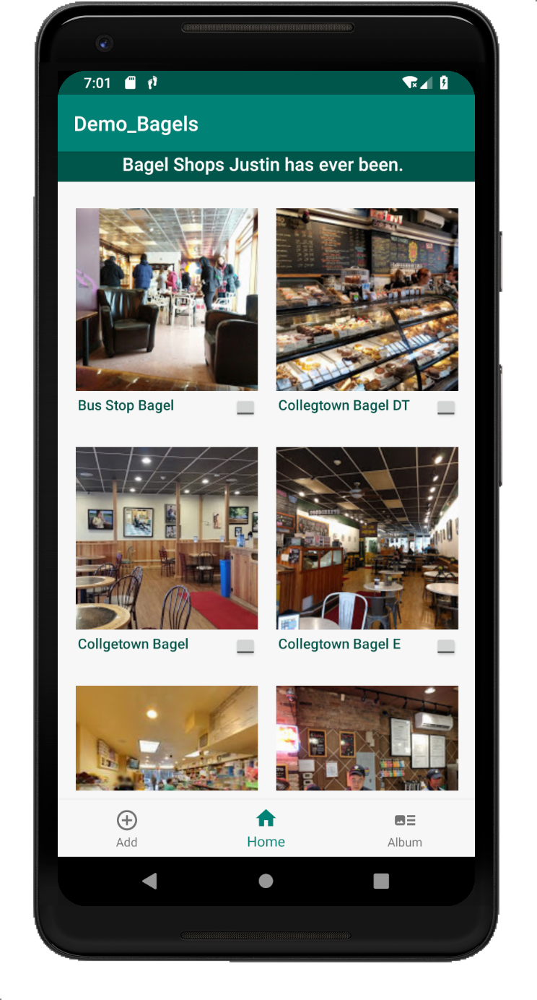

# bagels-android

Demo-bagels

Tapline: An android demo.

IOS repo link: https://github.com/lcj420106/bagels-android

Screenshot:

Description: 
Run on Pixel 2 XL API 28(Android 9, API 28).
Use GridView to list some bagel shops. 
Use BottomNavigationView to seperate the fragments. 
Trying to impletement Google Map API. 
The next step is to make an album list in the album Fragment, and build a SQLite Database.
